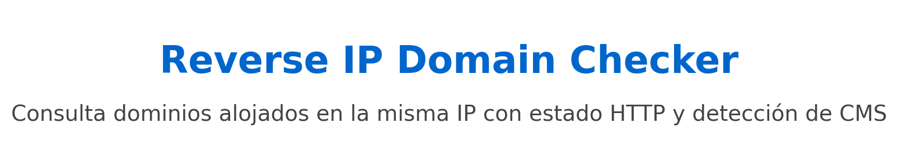

# Reverse IP Domain Checker

Este script de Python permite realizar un **Reverse IP Domain Check**, mostrando los dominios alojados en el mismo servidor que el dominio o IP ingresado. Adicionalmente, muestra el **estado HTTP** (200, 301, 404, etc.) y trata de detectar el **CMS** o tecnología utilizada en cada dominio (por ejemplo, WordPress, Joomla, Drupal, etc.).

## Características

- Consulta dominios alojados en la misma IP utilizando [YouGetSignal](https://domains.yougetsignal.com/domains.php).
- Detecta el estado HTTP de cada dominio (200, 301, 404, etc.).
- Detecta el CMS o tecnología en uso (WordPress, Joomla, Drupal, etc.).
- Salida en terminal con colores para mayor legibilidad.
- Guarda los resultados en un archivo de texto.

## Requisitos

Para ejecutar este script, necesitas tener Python 3 y las siguientes bibliotecas instaladas:

- `requests`
- `colorama`

Instala las dependencias ejecutando:

pip install requests colorama

# Uso
python reverse_ip_checker.py

# Ejemplo de Salida

Ingrese el dominio o IP para el Reverse IP Domain Check: example.com

Dominios encontrados en el mismo servidor que example.com:
[ 001 ] -- example1.com           -- [ 200 ] -- [ WordPress ]
[ 002 ] -- example2.com           -- [ 301 ] -- [ Drupal ]
[ 003 ] -- example3.com           -- [ 404 ] -- [ ??? ]
[ 004 ] -- example4.com           -- [ 200 ] -- [ Joomla ]

# Créditos
Este proyecto utiliza el servicio YouGetSignal para realizar la consulta de dominios alojados en la misma IP.
